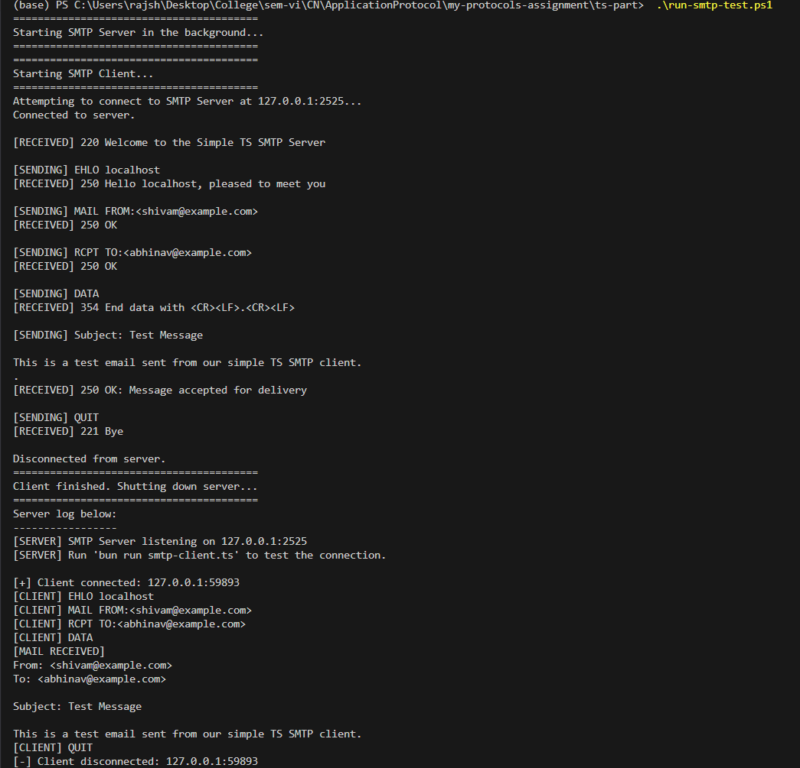
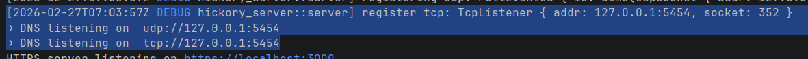
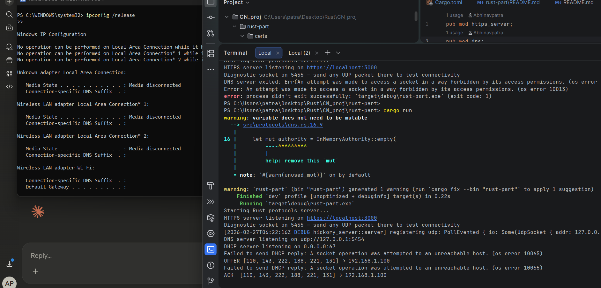
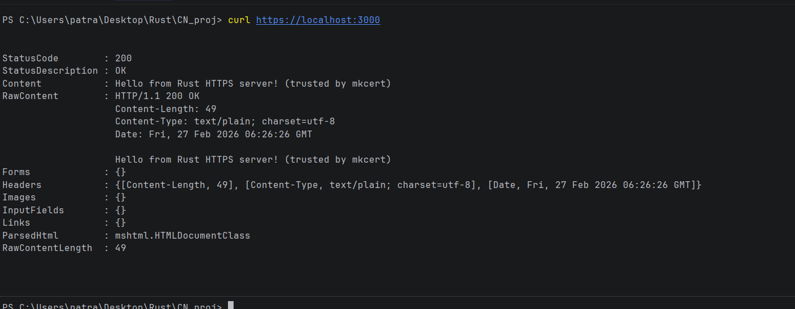

Assignment by
- Abhinav Patra: 23103069
- Shivam Raj: 23103073
- Rahul Kumar: 23103051

## Project structure.
```
application-layer-protocols/
├── README.md                  # explain split, how to run each part, why Rust vs JS
├── rust-part/                 # HTTPS server + DNS + DHCP
│   ├── Cargo.toml
│   ├── Cargo.lock
│   └── src/
│       ├── main.rs
│           ├──protocols
│                ├── https_server.rs
│                ├── dns.rs
│                ├── dhcp.rs
│
│
│
└── js-part/                   # FTP server + SMTP (client or simple server)
        ├── package.json
        ├── server.js              # main entry, or separate files
        ├── ftp-server.js
        └── smtp.js
```

# Application Protocol Assignment

## 1. What are Application Layers?

Think of the Application Layer as the "face" of the internet. When you open a web browser, send an email, or download a file, you are interacting with the Application Layer. It is the topmost layer in the OSI (Open Systems Interconnection) and TCP/IP models.

Simply put, the Application Layer is where network applications live and work. It provides the tools and rules for different software applications to communicate over a network, ensuring that the data you see on your screen makes sense.

## 2. What Does It Do? (Its Application)

The main job of the application layer is to provide services directly to the user's applications.

- **Web Browsing:** It fetches web pages and shows them to you.
- **Emailing:** It sends your emails to the right person and receives emails for you.
- **File Sharing:** It helps you download or upload files between computers safely.
- **Translating Data:** It ensures that if a computer sends a picture, the receiving computer knows it is a picture and displays it correctly.

In short, it acts as a bridge between the software you are using (like Chrome or Outlook) and the rest of the complicated network below it.

## 3. Different Protocols It Follows

Protocols are simply "rules of communication." For the application layer to do its many different jobs, it uses specific protocols for specific tasks. Some of the most common ones are:

- **HTTP/HTTPS (HyperText Transfer Protocol):** For browsing websites.
- **FTP (File Transfer Protocol):** For transferring files from one computer to another.
- **SMTP (Simple Mail Transfer Protocol):** For sending emails.
- **DNS (Domain Name System):** For converting website names (like google.com) into IP addresses.
- **DHCP (Dynamic Host Configuration Protocol):** For automatically assigning IP addresses to devices on a network.

---

## 4. Application Protocols & Code Implementation

Here is a simple look at the major protocols and how we implemented them in this assignment.

### I. FTP (File Transfer Protocol)

FTP is a standard protocol used to transfer computer files between a client and server on a computer network. Think of it like a delivery service for your files. We created a basic FTP server where a user can connect, log in with a username and password, and request the current directory.

**FTP Server Code (TypeScript):**

```typescript
import net from "net";

const PORT = 2121;
const HOST = "127.0.0.1";

interface ClientState {
  isAuthenticated: boolean;
  username: string | null;
}

const server = net.createServer((socket) => {
  console.log(
    `[+] Client connected: ${socket.remoteAddress}:${socket.remotePort}`,
  );

  const state: ClientState = {
    isAuthenticated: false,
    username: null,
  };

  socket.write("220 Welcome to the Simple TS FTP Server\r\n");

  socket.on("data", (data) => {
    const message = data.toString().trim();
    if (!message) return;

    console.log(`[CLIENT] ${message}`);

    const parts = message.split(" ");
    const command = (parts[0] ?? "").toUpperCase();
    const args = parts.slice(1).join(" ");
    switch (command) {
      case "USER":
        if (!args) {
          socket.write("501 Syntax error in parameters or arguments.\r\n");
          break;
        }
        state.username = args;
        socket.write(`331 User ${args} okay, need password.\r\n`);
        break;

      case "PASS":
        if (!state.username) {
          socket.write("503 Bad sequence of commands (send USER first).\r\n");
          break;
        }
        if (
          state.username === "anonymous" ||
          (state.username === "admin" && args === "password")
        ) {
          state.isAuthenticated = true;
          socket.write("230 User logged in, proceed.\r\n");
        } else {
          socket.write("530 Login incorrect.\r\n");
          state.username = null;
        }
        break;

      case "SYST":
        socket.write("215 UNIX Type: L8\r\n");
        break;
        if (!state.isAuthenticated) {
          socket.write("530 Please login with USER and PASS.\r\n");
          break;
        }
        socket.write('257 "/" is the current directory\r\n');
        break;

      case "QUIT":
        socket.write("221 Service closing control connection.\r\n");
        socket.end();
        break;

      default:
        socket.write("502 Command not implemented.\r\n");
        break;
    }
  });

  socket.on("end", () => {
    console.log(
      `[-] Client disconnected: ${socket.remoteAddress}:${socket.remotePort}`,
    );
  });

  socket.on("error", (err) => {
    console.error(`[!] Socket error:`, err);
  });
});

server.listen(PORT, HOST, () => {
  console.log(`[SERVER] FTP Control Server listening on ${HOST}:${PORT}`);
  console.log(`[SERVER] Run 'bun run ftp-client.ts' to test the connection.\n`);
});
```

**FTP Client Code (TypeScript):**

```typescript
import net from "net";

const PORT = 2121;
const HOST = "127.0.0.1";

console.log(`Attempting to connect to FTP Server at ${HOST}:${PORT}...`);

const client = net.createConnection({ port: PORT, host: HOST }, () => {
  console.log("Connected to server.\n");
});

const commands = ["USER admin", "PASS password", "SYST", "PWD", "QUIT"];

let currentCommandIndex = 0;

function sendNextCommand() {
  if (currentCommandIndex < commands.length) {
    const cmd = commands[currentCommandIndex];
    console.log(`[SENDING] ${cmd}`);

    client.write(`${cmd}\r\n`);
    currentCommandIndex++;
  }
}

client.on("data", (data) => {
  const message = data.toString().trim();
  console.log(`[RECEIVED] ${message}\n`);

  sendNextCommand();
});

client.on("end", () => {
  console.log("\nDisconnected from server.");
});

client.on("error", (err) => {
  console.error("Client error:", err);
});
```


### II. SMTP (Simple Mail Transfer Protocol)

SMTP is the protocol responsible for sending emails. When you hit "send" in your email client, SMTP handles the process of pushing that email from your computer to the email server. We created a server to receive the mail and a client to send it.

**SMTP Server Code (TypeScript):**

```typescript
import net from "net";

const PORT = 2525;
const HOST = "127.0.0.1";

interface ClientState {
  state: "INIT" | "GREETED" | "MAIL_FROM" | "RCPT_TO" | "DATA";
  from: string | null;
  to: string[];
  data: string;
}

const server = net.createServer((socket) => {
  console.log(
    `[+] Client connected: ${socket.remoteAddress}:${socket.remotePort}`,
  );

  const state: ClientState = {
    state: "INIT",
    from: null,
    to: [],
    data: "",
  };

  socket.write("220 Welcome to the Simple TS SMTP Server\r\n");

  socket.on("data", (data) => {
    const message = data.toString();

    if (state.state === "DATA") {
      state.data += message;
      if (state.data.endsWith("\r\n.\r\n")) {
        console.log(
          `[MAIL RECEIVED]\nFrom: ${state.from}\nTo: ${state.to.join(
            ", ",
          )}\n\n${state.data.slice(0, -5)}`,
        );
        state.state = "GREETED";
        state.from = null;
        state.to = [];
        state.data = "";
        socket.write("250 OK: Message accepted for delivery\r\n");
      }
      return;
    }

    const trimmedMessage = message.trim();
    if (!trimmedMessage) return;

    console.log(`[CLIENT] ${trimmedMessage}`);

    const parts = trimmedMessage.split(" ");
    const command = (parts[0] ?? "").toUpperCase();
    const args = parts.slice(1).join(" ");

    switch (command) {
      case "HELO":
      case "EHLO":
        state.state = "GREETED";
        socket.write(`250 Hello ${args || "Client"}, pleased to meet you\r\n`);
        break;

      case "MAIL":
        if (state.state !== "GREETED") {
          socket.write("503 Bad sequence of commands\r\n");
          break;
        }
        if (args.toUpperCase().startsWith("FROM:")) {
          state.from = args.slice(5).trim();
          state.state = "MAIL_FROM";
          socket.write("250 OK\r\n");
        } else {
          socket.write("501 Syntax error in parameters or arguments\r\n");
        }
        break;

      case "RCPT":
        if (state.state !== "MAIL_FROM" && state.state !== "RCPT_TO") {
          socket.write("503 Bad sequence of commands\r\n");
          break;
        }
        if (args.toUpperCase().startsWith("TO:")) {
          state.to.push(args.slice(3).trim());
          state.state = "RCPT_TO";
          socket.write("250 OK\r\n");
        } else {
          socket.write("501 Syntax error in parameters or arguments\r\n");
        }
        break;

      case "DATA":
        if (state.state !== "RCPT_TO") {
          socket.write("503 Bad sequence of commands\r\n");
          break;
        }
        state.state = "DATA";
        socket.write("354 End data with <CR><LF>.<CR><LF>\r\n");
        break;

      case "QUIT":
        socket.write("221 Bye\r\n");
        socket.end();
        break;

      default:
        socket.write("502 Command not implemented\r\n");
        break;
    }
  });

  socket.on("end", () => {
    console.log(
      `[-] Client disconnected: ${socket.remoteAddress}:${socket.remotePort}`,
    );
  });

  socket.on("error", (err) => {
    console.error(`[!] Socket error:`, err);
  });
});

server.listen(PORT, HOST, () => {
  console.log(`[SERVER] SMTP Server listening on ${HOST}:${PORT}`);
  console.log(
    `[SERVER] Run 'bun run smtp-client.ts' to test the connection.\n`,
  );
});
```

**SMTP Client Code (TypeScript):**

```typescript
import net from "net";

const PORT = 2525;
const HOST = "127.0.0.1";

console.log(`Attempting to connect to SMTP Server at ${HOST}:${PORT}...`);

const client = net.createConnection({ port: PORT, host: HOST }, () => {
  console.log("Connected to server.\n");
});

const commands = [
  "EHLO localhost",
  "MAIL FROM:<shivam@example.com>",
  "RCPT TO:<abhinav@example.com>",
  "DATA",
  "Subject: Test Message\r\n\r\nThis is a test email sent from our simple TS SMTP client.\r\n.",
  "QUIT",
];

let currentCommandIndex = 0;

function sendNextCommand() {
  if (currentCommandIndex < commands.length) {
    const cmd = commands[currentCommandIndex];
    console.log(`[SENDING] ${cmd}`);

    client.write(`${cmd}\r\n`);
    currentCommandIndex++;
  }
}

client.on("data", (data) => {
  const message = data.toString().trim();
  console.log(`[RECEIVED] ${message}\n`);

  if (message.startsWith("354")) {
    sendNextCommand();
  } else if (
    message.startsWith("220") ||
    message.startsWith("250") ||
    message.startsWith("221")
  ) {
    sendNextCommand();
  } else if (message.startsWith("5")) {
    console.error("Error from server. Aborting.");
    client.end();
  }
});

client.on("end", () => {
  console.log("\nDisconnected from server.");
});

client.on("error", (err) => {
  console.error("Client error:", err);
});
```



### III. DNS (Domain Name System)

DNS is the phonebook of the internet. It translates human-friendly URLs (like `google.com`) into computer-friendly IP addresses. Our Rust implementation acts as a server that can manage local zones and provide lookups.

### IV. DHCP (Dynamic Host Configuration Protocol)

DHCP is the protocol used to automatically assign IP addresses to devices on a network. It manages IP leases and ensures that every device in a local network has a unique identity without manual configuration.

---

# Rust-part: Application Layer Protocols

This part of the assignment showcases the power of Rust for networked, asynchronous services.

## Project Structure

```text
rust-part/
├── Cargo.toml                  # Defines dependencies and metadata
└── src/
    ├── main.rs                 # Central entry point spawning the servers asynchronously
    └── protocols/
        ├── https_server.rs     # axum based HTTPS encrypted web server
        ├── dns.rs              # Hickory-server based DNS handler
        └── dhcp.rs             # DHCP parsing & DORA flow logic
```

## Dependencies & Setup

The `Cargo.toml` file captures our core dependencies for managing the protocols cleanly (using roughly 1-2 lines per category):

- **Web & Async:** `axum` mappings enable HTTP endpoint configuration over the `tokio` asynchronous runtime.
- **Security:** `axum-server` and `rustls-pemfile` handle loading our PEM files and securing connections via robust TLS certificates.
- **Protocols:** `hickory-server` and `dhcproto` wrap low-level packet parsing complexities for DNS interactions and DHCP packet generation safely.

To execute the project, ensure you use `mkcert` (`mkcert -install` and `mkcert localhost`) to populate the `rust-part` with certificates valid for HTTPS serving. Run all services natively via `cargo run`.

## Protocol Specifications & Code

### 1. DNS server (Port 5454)

Operating on `5454` natively, our lightweight DNS server executes successfully as a forwarder. It parses queries utilizing `hickory` and provides local zone support for `example.local`. It supports both UDP and TCP connections for maximum compatibility.

**DNS Server Code (Rust):**

```rust
pub async fn run_dns_server() -> Result<()> {
    let mut catalog = Catalog::new();
    let origin = Name::from_str("example.local.")?;
    let serial = 2025022701u32;

    let mut authority = InMemoryAuthority::empty(origin.clone(), ZoneType::Primary, false);
    // ... upsert SOA, NS, A records ...

    let addr: SocketAddr = "127.0.0.1:5454".parse()?;
    let mut server = ServerFuture::new(catalog);

    let udp = UdpSocket::bind(addr).await?;
    server.register_socket(udp);

    let tcp = TcpListener::bind(addr).await?;
    server.register_listener(tcp, Duration::from_secs(10));

    println!("→ DNS listening on  udp://127.0.0.1:5454");
    server.block_until_done().await?;
    Ok(())
}
```



### 2. DHCP server (Port 67)

Dynamic Host Configuration Protocol is critical for granting valid network IP addresses. By leveraging `dhcproto`, the server correctly evaluates network leases and fully executes the **DORA** flow seamlessly — **D**iscover → **O**ffer → **R**equest → **A**ck. Inform and Release operations are additionally supported.

**DHCP Server Code (Rust):**

```rust
pub async fn run_dhcp_server() -> Result<()> {
    let bind_addr: SocketAddr = "0.0.0.0:67".parse()?;
    let socket = UdpSocket::bind(bind_addr).await?;
    socket.set_broadcast(true)?;

    println!("DHCP server listening on {}", bind_addr);

    let db = Arc::new(Mutex::new(LeaseDb::new()));
    let mut buf = vec![0u8; 1500];

    loop {
        let (len, peer) = socket.recv_from(&mut buf).await?;
        let msg = match Message::decode(&mut Decoder::new(&buf[..len])) {
            Ok(m) => m,
            Err(e) => continue,
        };

        if msg_type == MessageType::Discover {
            let mut db = db_clone.lock().await;
            if let Some(offered_ip) = db.assign(&mac) {
                let reply = build_reply(&msg, offered_ip, MessageType::Offer);
                send_reply(socket_ref, &reply).await;
                println!("OFFER {:?} → {}", mac, offered_ip);
            }
        }
    }
}
```



### 3. HTTPS server (Port 3000)

For secure web communication, we implement an HTTPS server utilizing `axum-server` with `rustls`. It loads certificates generated via `mkcert` to provide a trusted local development experience over encrypted channels.

**HTTPS Server Code (Rust):**

```rust
pub async fn run_http_server() -> Result<(), Box<dyn std::error::Error>> {
    let app = Router::new().route("/", get(handler));
    let addr = SocketAddr::from(([127, 0, 0, 1], 3000));

    let certs = rustls_pemfile::certs(&mut BufReader::new(File::open("certs/cert.pem")?))
        .collect::<Result<Vec<_>, _>>()?;
    let key = rustls_pemfile::pkcs8_private_keys(&mut BufReader::new(File::open("certs/key.pem")?))
        .next().unwrap()?;

    let config = rustls::ServerConfig::builder()
        .with_no_client_auth()
        .with_single_cert(certs, PrivateKeyDer::Pkcs8(key))?;

    let tls_config = RustlsConfig::from_config(Arc::new(config));
    println!("HTTPS server listening on https://localhost:3000");

    axum_server::bind_rustls(addr, tls_config)
        .serve(app.into_make_service())
        .await?;
    Ok(())
}
```


